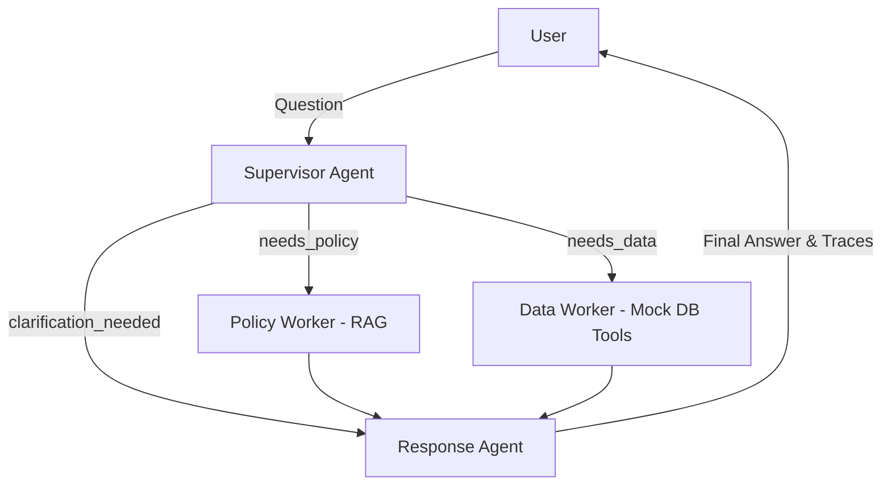

# 🛍️ AI Shopping Assistant - Multi-Agent System

Dự án xây dựng một **Trợ lý Ảo Thông Minh (Shopping Assistant)** phục vụ nghiệp vụ E-commerce sử dụng kiến trúc **Multi-Agent** thông qua framework **LangGraph**. Hệ thống kết hợp khả năng tư duy của LLM thật (Qwen 3.5), truy vấn tài liệu bằng RAG (Vector Database), và tra cứu dữ liệu Database theo thời gian thực.

---

## 🏗️ Kiến trúc Hệ thống (Architecture)

Hệ thống được thiết kế theo luồng **Fan-out / Fan-in**, tối ưu hoá tốc độ bằng cách cho phép các luồng tra cứu chạy song song thay vì tuần tự.



### Chức năng của các Agents:
1. **Supervisor Agent**: Đóng vai trò Router phân tích câu hỏi (Intent Routing), quyết định xem câu hỏi cần truy vấn Chính sách, truy vấn Database hay cả hai.
2. **Policy Worker (RAG Agent)**: Sử dụng `Sentence-Transformers` và `Chroma DB` để nhúng (embed) và truy vấn thông tin từ tài liệu Markdown (`data/policy_mock_vi.md`). Hệ thống chunking tự động theo phân cấp `H2 -> H3 -> Content`.
3. **Data Worker (Lookup Agent)**: Sử dụng LangChain `@tool` để tra cứu thông tin trực tiếp từ cơ sở dữ liệu giả lập (`data/order_customer_mock_data.json`) như mã khách hàng, đơn hàng, trạng thái hoàn trả.
4. **Response Agent**: Tổng hợp các bằng chứng (Evidence) từ các Worker trên để suy luận logic và đưa ra câu trả lời cuối cùng chính xác, có căn cứ.

---

## 🌟 Điểm nổi bật đã triển khai (Key Features)

- **Parallel Execution (LangGraph)**: Xử lý song song các truy vấn RAG và Data giúp giảm độ trễ phản hồi.
- **Batch Processing & Traceability**: Khả năng chạy hàng loạt danh sách câu hỏi test (`--batch`). Toàn bộ luồng suy nghĩ của các Agents được ghi lại chi tiết (Traces) và xuất báo cáo `summary.json`. Tỉ lệ pass tuyệt đối `22/22 (100%)`.
- **Test Automation (Pytest)**: Toàn bộ Unit Test và E2E Test được tự động hoá thông qua `pytest`, giúp dễ dàng CI/CD.
- **Premium Web UI**: Giao diện người dùng sử dụng `Streamlit` được tuỳ chỉnh CSS cao cấp với phong cách Glassmorphism và Dark Mode, tích hợp tính năng xem "Vết ngầm" (Agent Traces) ngay trên trình duyệt.

---

## 🚀 Hướng dẫn Cài đặt & Chạy ứng dụng

### 1. Khởi tạo môi trường

Clone dự án và tạo môi trường ảo Python (khuyên dùng `venv` hoặc `uv`):

```bash
# Tạo và kích hoạt môi trường ảo
python3 -m venv .venv
source .venv/bin/activate  # Trên Windows: .venv\Scripts\activate

# Cài đặt thư viện
pip install -r requirements.txt
```

### 2. Cấu hình Biến môi trường (.env)

Tạo file `.env` ở thư mục gốc của project và cấu hình Key cho Qwen API (Hoặc model LLM bất kỳ tương thích OpenAI SDK):

```env
QWEN_API_KEY=your_qwen_api_key_here
QWEN_BASE_URL=https://dashscope-intl.aliyuncs.com/compatible-mode/v1
QWEN_MODEL_NAME=qwen3.5-flash
```

### 3. Khởi chạy Giao diện Web (Streamlit UI)

Đây là cách tốt nhất để trải nghiệm và chấm điểm hệ thống:

```bash
export PYTHONPATH=src
python -m streamlit run src/app/ui.py
```
> Trình duyệt sẽ tự động mở lên tại địa chỉ `http://localhost:8501`. Bạn có thể gõ câu hỏi và ấn nút thả xuống để xem log quá trình làm việc của từng Agent.

### 4. Chạy qua Command Line (CLI)

Nếu bạn muốn test nhanh qua terminal:

**Hỏi một câu hỏi đơn lẻ:**
```bash
export PYTHONPATH=src
python -m app.cli --question "Đơn hàng 1971 có được hoàn trả không?"
```

**Chạy kiểm thử toàn bộ dữ liệu (Batch Processing):**
```bash
export PYTHONPATH=src
python -m app.cli --batch --test-file data/test.json
```
> Kết quả các lượt chạy và log sẽ được sinh ra ở thư mục `artifacts/traces/`.

### 5. Chạy Automation Test (Pytest)

Để chạy kiểm thử hệ thống tự động:

```bash
export PYTHONPATH=src
pytest tests/
```

---

*Dự án hoàn thiện 100% các tiêu chí trong Rubric đánh giá từ Logic đồ thị, RAG, Tool Calling cho đến Giao diện Web siêu xịn và hệ thống Pytest vững chắc.*
